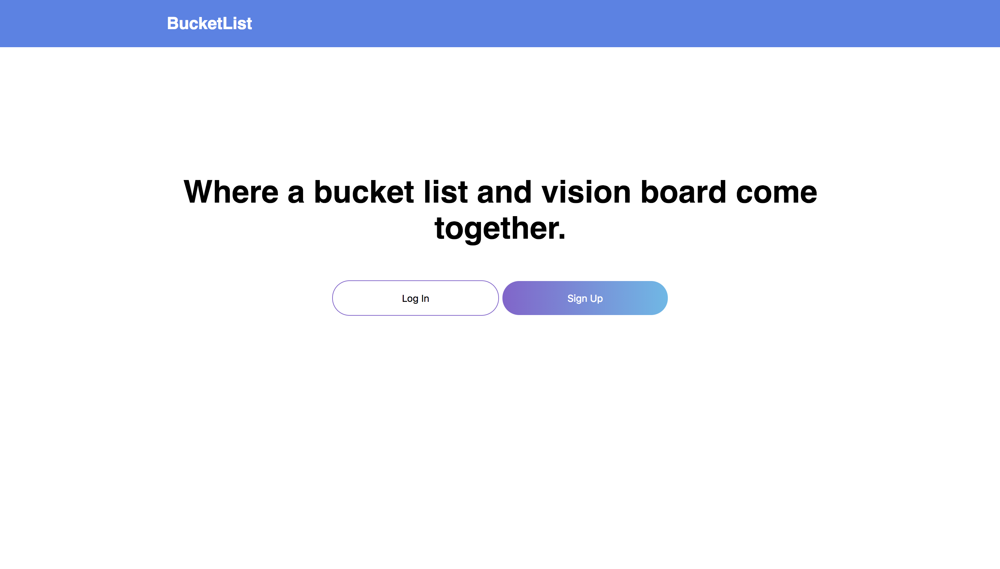

<h1>BucketList</h1>

Most of us have dreams/goals we want to achieve or experiences we want to live, and maybe write them down on our 'bucket list.' I had an idea of wanting to mix both a bucket list and vision board, and came up with this app idea. <b>BucketList</b>, is an app to keep your goals/experiences saved as seperate posts. On each post, you can add notes. Maybe you'll want to add notes on different prices for traveling somewhere, or resources to learn to play an instrument. You can also add images to each post, for inspiration. Maybe you'll want to upload pictures of Paris, on your "Travel to Paris" post. When you achieve/complete something, you can check it off and will be marked as completed!

Live app here : (https://dry-tor-94424.herokuapp.com/)

<h2>Screenshots</h2>

Landing Page

Login Page

Sign Up Page

Home Page

Single Post Page

<h2>Technology Used</h2>

<h4>Front-end</h4>
<ul>
    <li>HTML5</li>
    <li>CSS3</li>
    <li>JavaScript</li>
    <li>Jquery</li>
</ul>

<h4>Back-end</h4>
<ul>
    <li>Node.js</li>
    <li>Express</li>
    <li>MongoDB</li>
    <li>Mongoose</li>
    <li>Passport</li>
    <li>JWT Authentication</li>
    <li>Mocha</li>
    <li>Chai</li>
</ul>

